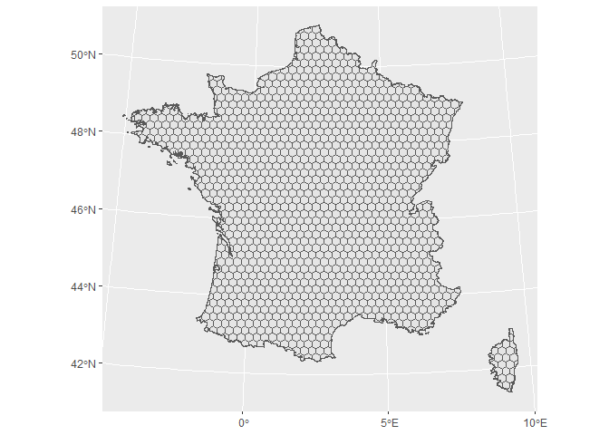
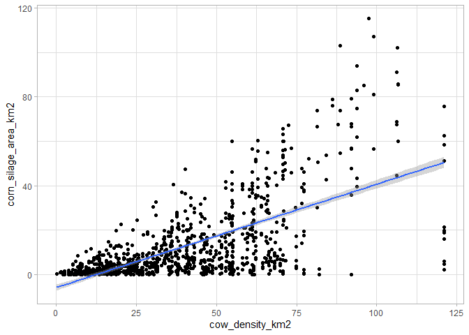
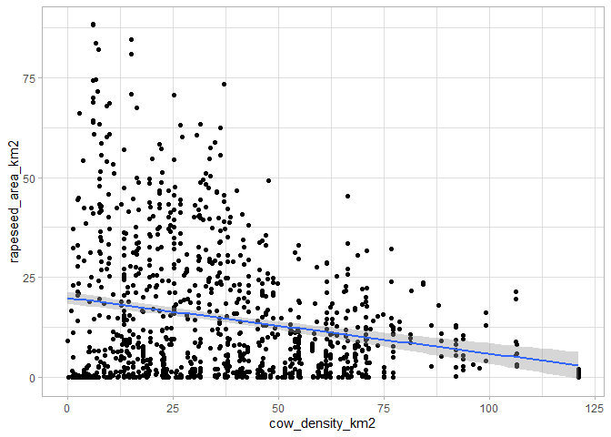
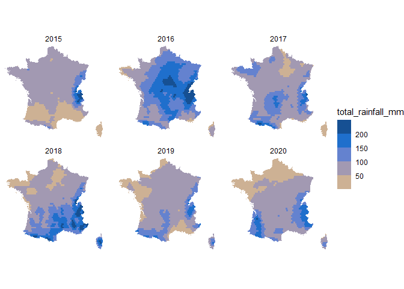

# {frex} package

{frex} stands for “FRench hEXagons”.

The goal of this package is to provide several layers of information for
metropolitan France, particularly useful for analyzing agricultural
systems.

The basis of this package is a gridded map of France in hexagons of
about 450 km2. For each hexagon, different information can be added
using the package function, such as the surface area occupied by
different types of crop, the nature of the soil or climatic data.

The data is not included in the package itself, but is called up via
URL. It therefore requires an Internet connection to operate.

Package data can be used to illustrate the diversity of French farming
systems. They can also be used to enrich other datasets for multivariate
analysis (e.g. to add pedoclimatic characteristics to studied
agricultural plots), as we did in this
[article](https://link.springer.com/article/10.1007/s13593-022-00770-y).

# 1. Package installation

The package may be downloaded from GitHub. It may also be downloaded
directly from R with the following command:

    # Installation directly with R (to use only once):
    # devtools::install_github("BjnNowak/frex")

    # Once installed, you may load it into your R session
    library(frex)

    # Two other packages will be useful to process the data: {tidyverse} and {sf}
    library(tidyverse)
    library(sf)

# 2. Static data layers

The package is based on a hexagonal grid of metropolitan france, to
which data layers can be added. This grid may be loaded as follows,
using the **get\_map()** function:

    hex<-get_map() # No argument

    # Plot hexagonal grid
    ggplot(hex)+
      geom_sf()

This base map can be enhanced by adding several layers of data.

Static data layer (not updated from year to year) may be added with the
**get\_static\_layer()** function.

Different type of data may be added this way:

-   “soil” for soil feature;
-   “crops” for main crops distribution;
-   “herds” for farm animal density.

The distribution of crops and animals can vary over time, but an initial
analysis showed that these distributions were very stable from one year
to the next. As a first approximation, they were therefore considered as
“stable” layers.

Below an example to get the distribution of sunflower crops in France.

    hex<-get_map()%>%
      # Join static layer with the hexagonal grid
      left_join(get_static_layer(layer="crops"))

    ggplot(hex)+
      geom_sf(
        aes(fill=sunflower_area_km2),
        color="grey90"
      )+
      scale_fill_gradient(
        low="#fff95b",high="#ff930f",
        na.value = "grey95")+
      theme_void()

But we can also conduct analyses without using the base map to plot
data, simply by confronting two data layers.

    # Start with farm animal density
    data<-get_static_layer(layer="herds")%>%
      # Join static layer with crops distribution
      left_join(get_static_layer(layer="crops"))

    # Compare the two data
    ggplot(data,aes(x=cow_density_km2,y=corn_silage_area_km2))+
      geom_point()+
      geom_smooth(method='lm')+
      theme_light()

As expected, there is a positive correlation between the number of cows
per km2 and the corn silage area, as it is one of the fodders
given to animals.

This is not the case when comparing cow density with rapeseed area, a
crop more traditionally associated with farms without livestock:

    ggplot(data,aes(x=cow_density_km2,y=rapeseed_area_km2))+
      geom_point()+
      geom_smooth(method='lm')+
      theme_light()

for all these examples, table joins are based on the “hex\_id” column
(which identifies the hexagon to which the data is associated), so it’s
best not to change the name of this column.

# 3. Time series data layers

Adding time series layers works in the same way as adding “static”
layers, except that the **get\_time\_layer()** function has two
additional arguments (*from* and *to*) to delimit the years bordering
the selection.

Let’s use this function to compare the total rainfall in May for the
last years available in the dataset:

    data<-get_map()%>%
      left_join(get_time_layer(layer="rainfall",from=2015,to=2020))

    ggplot(data%>%filter(month==5))+
      geom_sf(
        aes(fill=total_rainfall_mm),
        color=NA
      )+
      scale_fill_steps2(
        low = "#F8CF6A",
        mid = "#2178dd",
        high = "#0F3A6B",
        midpoint = 150,
        breaks=seq(50,200,50)
      )+
      facet_wrap(.~year)+
      theme_void()

As shown above, May 2016 was a particularly wet month.

I’ll be adding more data layers over time.

# References

-   Soil features from [SoilGrids](https://soilgrids.org/)
-   Crop distribution from the Land-Parcel Identification System
    ([Registre Parcellaire
    Graphique](https://www.data.gouv.fr/fr/datasets/registre-parcellaire-graphique-rpg-contours-des-parcelles-et-ilots-culturaux-et-leur-groupe-de-cultures-majoritaire/)
    in France) of the European Common Agricultural Policy
-   Herd density from
    [Agreste](https://agreste.agriculture.gouv.fr/agreste-web/)
-   Climate data from
    [ERA5](https://developers.google.com/earth-engine/datasets/catalog/ECMWF_ERA5_MONTHLY)
    (Copernicus Climate Change Service)
